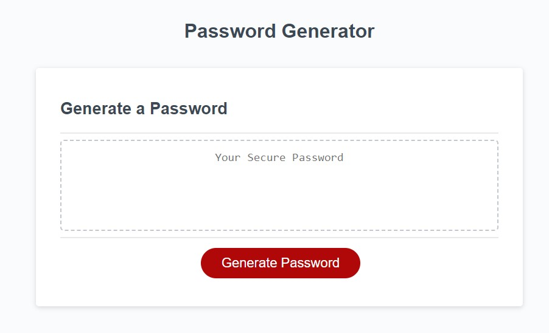
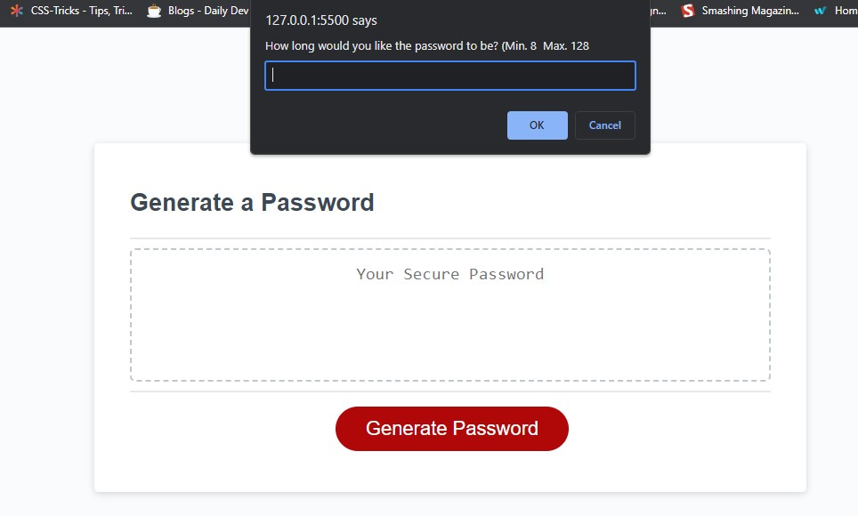
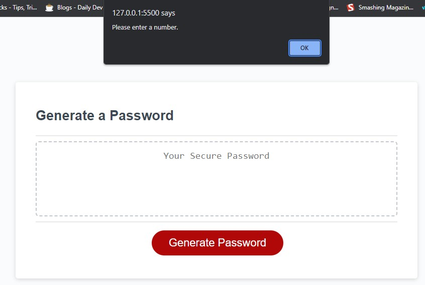
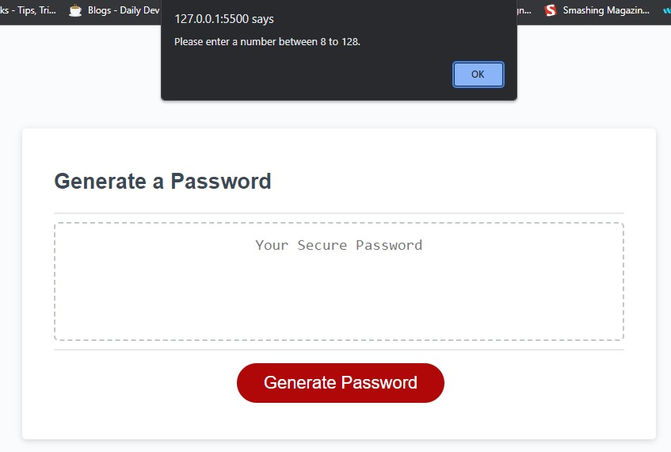
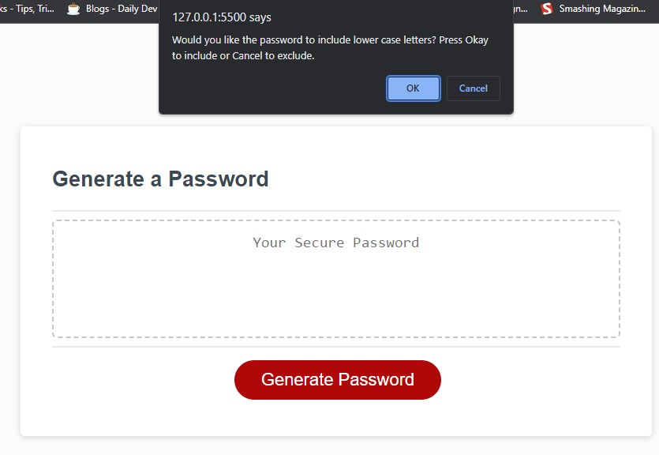
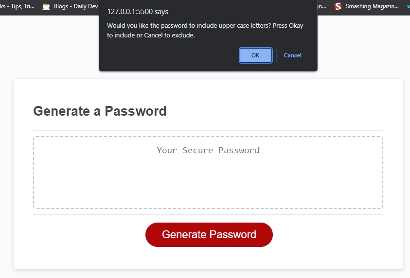
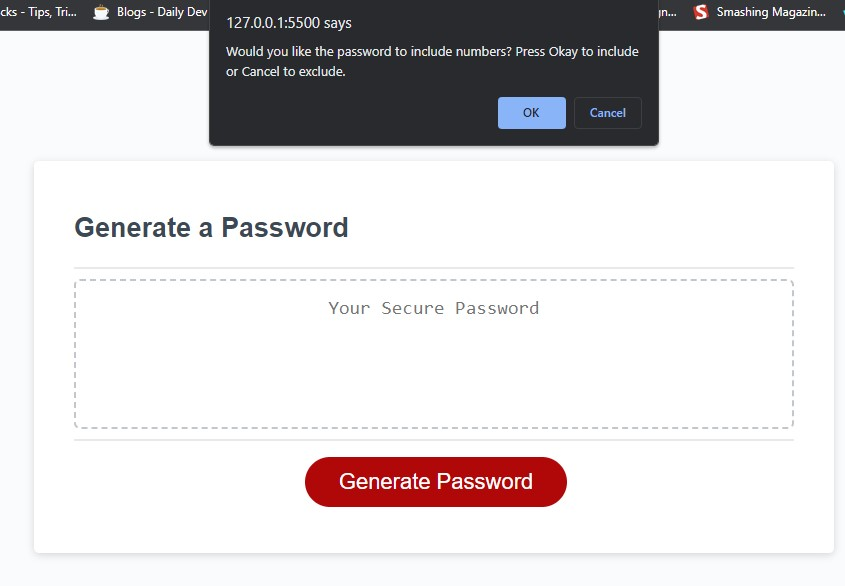
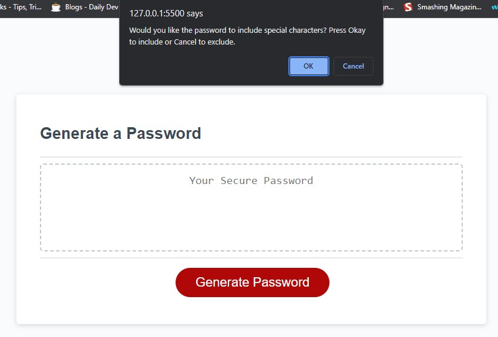
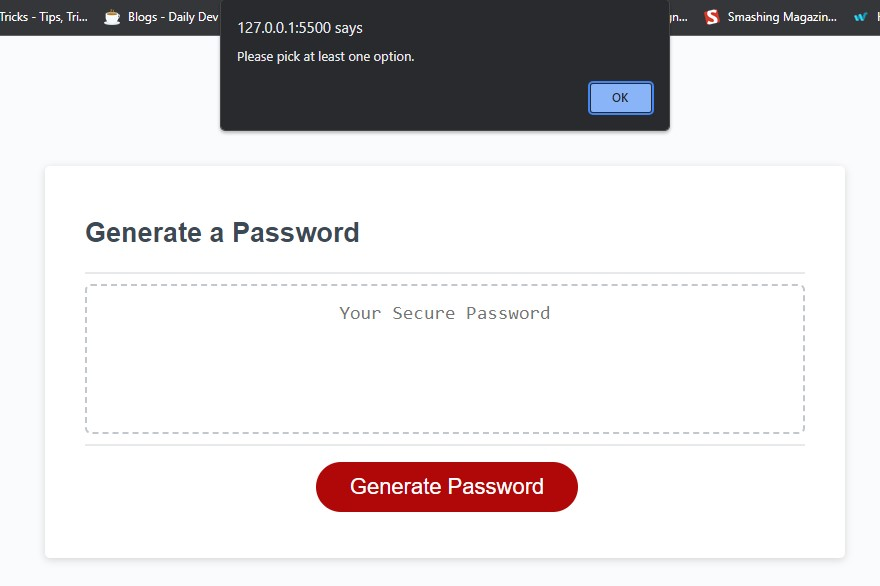
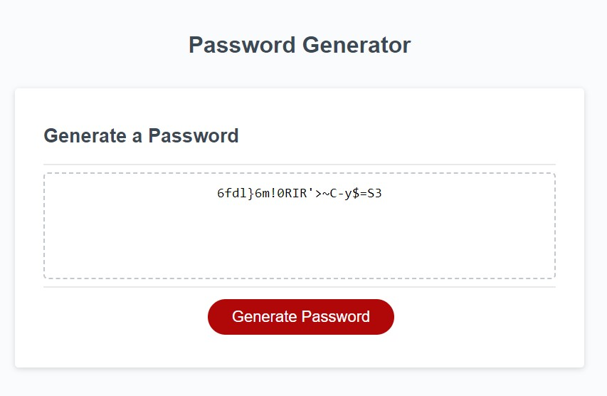

# Weekly Challenge 3 -  JavaScript: Password Generator

## Table of Content

- [Description](#description)
- [Features](#features)
- [Deployment](#deployment)
- [Usage](#usage)
- [Issues](#issues)
- [Links](#links)
- [Credits](#credits)

## Description

This is a simple web application that allows users to create randomly generated passwords based on a chosen combination of arrays.

The process of gathering user input, generating password, and displaying the generated password onto the webpage are all done via javascript.

## Features

- User input for password length (between 8 and 128 characters).
- Options to include lowercase letters, uppercase letters, numbers, and special characters.
- Validation to ensure at least one character type is selected.
- Generation of a random password based on the selected character type(s).
- Display of the generated password on to the webpage.

## Deployment

Simply click on the provided URl in the [Links](#links) section to access the web application.

No dependencies and requirements.

## Usage

Upon accessing the application users will be presented with the following webpage in their browser.

Clicking on the "Generate Password" button will display a prompt asking users to enter their desired password length between 8 and 128 characters.

If users did not enter anything before clicking OK, a warning will display asking them to do so. The process will then restart from the top.

If the password length chosen is outside of the acceptable range,  warning will display asking them to enter a password length inside the acceptable range. The process will then restart from the top.

Once the user had entered a acceptable password length, the application will then ask them to confirm if they would like to include different character types.

If users did not choose any character types, a warning will display asking them to include at least one character type. The process will then restart from the top.

Once users have chosen their character type(s). A password will be generated and displayed onto the webpage.

## Issues

Although not included in the acceptance criteria. I wanted to add a way to stop the whole process when users click on "Cancel" on the password length prompt. I know I have the right code, but it doesn't seem to actually stop the function, it just displays the password length warning then restarts from the first step. I've commented out the code for now in case it creates any bugs.

## Links

[Access the password generator here!](https://cycbrian.github.io/Module-3-Challenge-Password-Generator/)

[Access my github here!](https://github.com/CYCBrian/Module-3-Challenge-Password-Generator)

## Credits

[Stack Overflow - Random password generator with prompts [closed] - Helped with js line 1-137](https://stackoverflow.com/questions/62627469/random-password-generator-with-prompts)

[MOSH - Creating a password generator using JavaScript - Helped with js line 1-137](https://forum.codewithmosh.com/t/creating-a-password-generator-using-javascript/18971)

[Geek For Geek - How to Generate a Random Password using JavaScript ? - Helped with js line 1-137](https://www.geeksforgeeks.org/how-to-generate-a-random-password-using-javascript/)

[MDN Web Doc - for](https://developer.mozilla.org/en-US/docs/Web/JavaScript/Reference/Statements/for)

[MDN Web Doc - EventTarget: addEventListener() method](https://developer.mozilla.org/en-US/docs/Web/API/EventTarget/addEventListener)

[LaunchSchool - Loops and Iterating](https://launchschool.com/books/javascript/read/loops_iterating)

[Stack Overflow - Unable to find how "undefined" is getting printed in Example](https://stackoverflow.com/questions/47547933/unable-to-find-how-undefined-is-getting-printed-in-example)

[MDN Web Doc - undefined](https://developer.mozilla.org/en-US/docs/Web/JavaScript/Reference/Global_Objects/undefined)

[Stack Overflow - getting undefined while printing the function value from an object](https://stackoverflow.com/questions/73765276/getting-undefined-while-printing-the-function-value-from-an-object)

[MDN Web Doc - Array.prototype.push()](https://developer.mozilla.org/en-US/docs/Web/JavaScript/Reference/Global_Objects/Array/push)

[MDN Web Doc - Addition assignment (+=)](https://developer.mozilla.org/en-US/docs/Web/JavaScript/Reference/Operators/Addition_assignment)

[Stack Overflow - Javascript prompt() - cancel button to terminate the function](https://stackoverflow.com/questions/12864582/javascript-prompt-cancel-button-to-terminate-the-function)

[W3 Schools - Window prompt()](https://www.w3schools.com/jsref/met_win_prompt.asp)

[W3 Schools - Window confirm()](https://www.w3schools.com/jsref/met_win_confirm.asp)

[W3 Schools - Window alert()](https://www.w3schools.com/jsref/met_win_alert.asp)

Xpert Learning Assistant

- - -

[Back to Top](#table-of-content)

- - -
© 2023 edX Boot Camps LLC. Confidential and Proprietary. All Rights Reserved.
